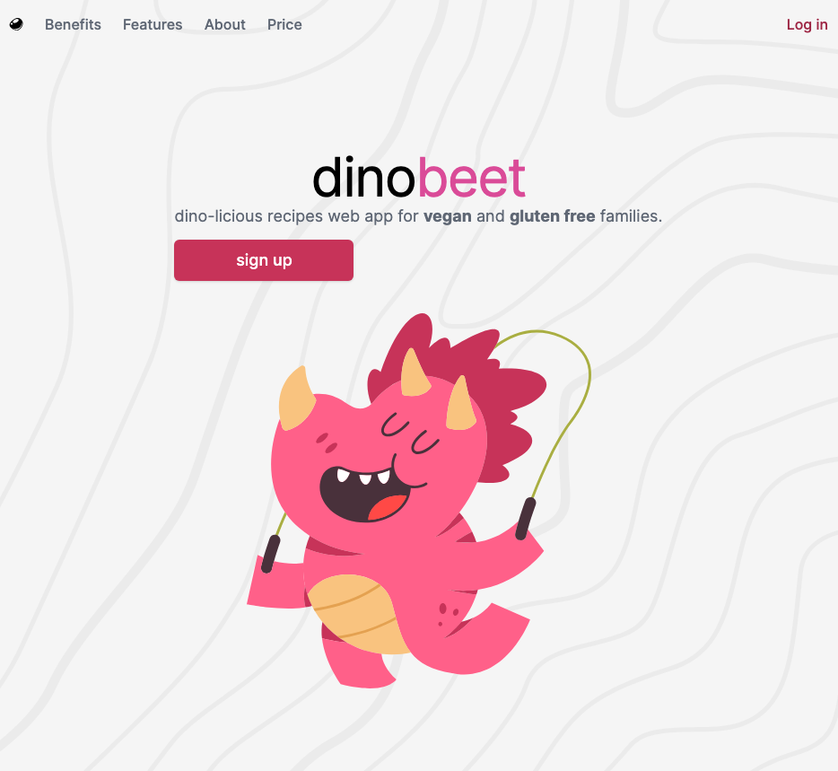

<a name="readme-top"></a>

<!-- PROJECT LOGO -->
<br />
<div align="center"
  <div align="center" style="width: 100%; text-align: center;">
    
  </div

<h3 align="center">Vegan Recipe Platform</h3>

  <p align="center">
    A specialized web platform for exploring and sharing vegan recipes.
    <br />
    ·
    <a href="https://github.com/mitchellabrouwer/dinobeet/issues">Report Bug</a>
    ·
    <a href="https://github.com/mitchellabrouwer/dinobeet/issues">Request Feature</a>
  </p>
</div>

<!-- ABOUT THE PROJECT -->

## About The Project

The Vegan Recipe Platform is designed to help users discover, share, and enjoy vegan recipes with ease. With a focus on security and user experience, the platform features secure login, enhanced recipe filtering options, and an intuitive search mechanism.

### Features

- Secure user authentication system.
- Advanced filtering based on ingredients, preparation time, and more.
- Intuitive search functionality to easily find your favorite recipes.
- User profiles for saving and sharing recipes.

<p align="right">(<a href="#readme-top">back to top</a>)</p>

### Built With

- [Next.js](https://nextjs.org/)
- [React](https://reactjs.org/)
- [Tailwind CSS](https://tailwindcss.com/)
- [Supabase](https://supabase.com/)
- [Prisma](https://www.prisma.io/)

<!-- GETTING STARTED -->

## Getting Started

To get a local copy up and running follow these simple steps.

### Prerequisites

- npm
  ```sh
  npm install npm@latest -g
  ```
